# Design System – Konzept

Dieses Dokument hält Konzept-Entscheidungen zum Design System fest (Kategorisierung, Naming, Struktur) – nicht die Umsetzung selbst. Umsetzung folgt später separat.

## Foundations / Tokens

Grundlegende, kontextlose Werte (Farben, Spacing, Radius, Typografie, Schatten). Siehe aktuell `src/renderer/tokens.css`.

## Components

Wiederverwendbare, in sich geschlossene UI-Bausteine (Button, Chip, Modal, Input …). Siehe aktuell `src/renderer/style.css` + der "Components"-Screen in der App.

## Patterns

Wiederkehrende Kombinationen mehrerer Components zu einem funktionalen Ganzen (z.B. Master-Detail-Layout, Formular-Dialog).

## Surface- und Elevation-Regel

Vollflächige Weißflächen sind für eigentlichen Inhalt reserviert: Leseflächen, Listen, Detailkarten, Formulare und Bereiche, in denen Textkontrast und Ruhe wichtiger sind als Tiefe.

Glassflächen sind Navigation/App-Chrome, Shell oder Overlay: Sidebar, Toolbar, Content Shell, Floating Footer, Popover, Modal-Umgebung. Sie dürfen Kontext durchscheinen lassen, sollen aber nicht als primäre Lesefläche dienen.

Elevation gehört zur Materialentscheidung:

1. **0 / Background:** App-Hintergrund, keine eigene Fläche, kein Shadow. Anwenden, wenn Bereiche nur durch Abstand, Rhythmus oder Layout getrennt werden. Nicht anwenden, wenn ein Element Inhalt halten oder klickbar sein soll.
2. **1 / Navigation / App Chrome:** feste App-Bedienung direkt auf dem Hintergrund: Sidebar, Topbar, App-Rand. Nicht für lange Texte, Formulare oder Hauptlisten.
3. **2 / Content Shell:** Glass-Arbeitsraum innerhalb der App. Anwenden, um den Hauptbereich zusammenzuhalten. Nicht als Lesefläche nutzen.
4. **3 / Solid Content Surfaces:** `--color-surface-default` plus sehr feiner Shadow/Border. Anwenden für Leseflächen, Tabellen, Formulare, Detailseiten und Editorflächen. Wichtig: Die Content Shell selbst ist Glass; erst die eigentlichen Inhaltsflächen darin sind solide weiß.
5. **4 / Overlay / Modal:** Scrim plus Dialog oder Popover über dem aktuellen Kontext. Anwenden für kurzlebige Entscheidungen. Nicht für dauerhafte Inhalte oder längere Workflows.

Raised Items, Rows, Hover, Focus und Selected States sind vorerst Unterregeln innerhalb von Content Surfaces und Interaktion, aber keine eigene Foundation-Ebene der Surface-Hierarchie.

Die App enthält dafür eine eigene Prüfansicht **Surfaces & Elevation**, damit Light/Dark, externer Monitor und Token-Änderungen visuell gegengeprüft werden können.

Die Prüfansicht orientiert sich konzeptionell an Material 3s "Applying elevation": Elevation wird nicht als reine Schatten-Tabelle gezeigt, sondern über Anwendungssituationen. Die Material-dp-Werte werden nicht 1:1 übernommen; maßgeblich bleiben unsere Surface-, Glass- und Shadow-Tokens.

Der ursprüngliche Shine/Soft-Bevel bleibt Teil des Material-Finishs. Er beschreibt nicht die Elevation selbst, sondern die weiche Flächenkante. Elevation entscheidet über Ebene, Trennung und Interaktionspriorität; Shine darf auf soliden Content- und Item-Flächen zusätzlich vorhanden sein, solange er subtil bleibt.

## Container-Regeln

Container beschreiben nicht nur "eine Box", sondern eine Verantwortlichkeit: Welche Ebene trennt den Raum, welche Ebene hält Inhalt, welche Ebene scrollt, und welche Ebene ist nur Interaktion.

### Hierarchie

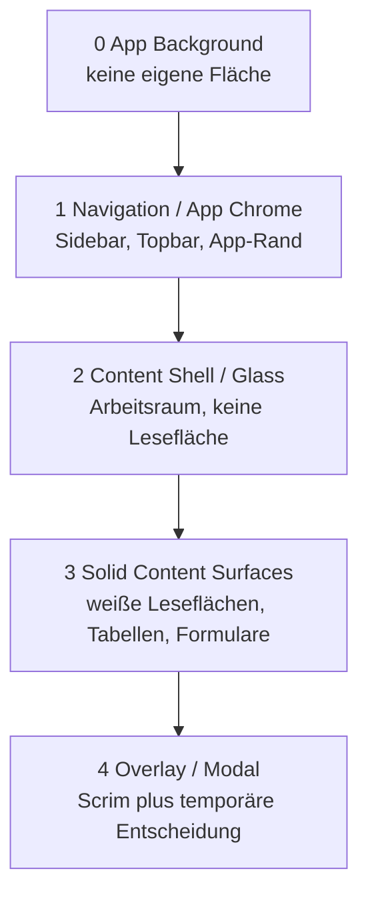

**Regel:** Jede Ebene muss einen eigenen Zweck haben. Wenn zwei Container nur deshalb existieren, um optisch "noch eine Box" zu bauen, ist einer davon zu viel.

Prototype-Referenz:

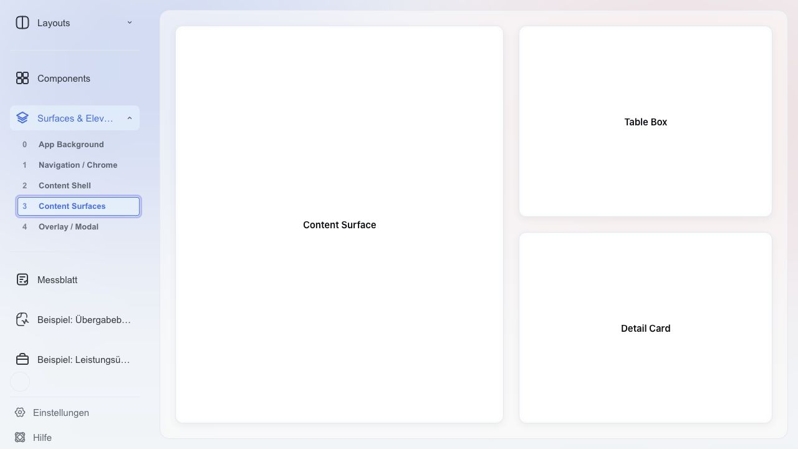

Surface-Stufen ohne Menü-Hover:

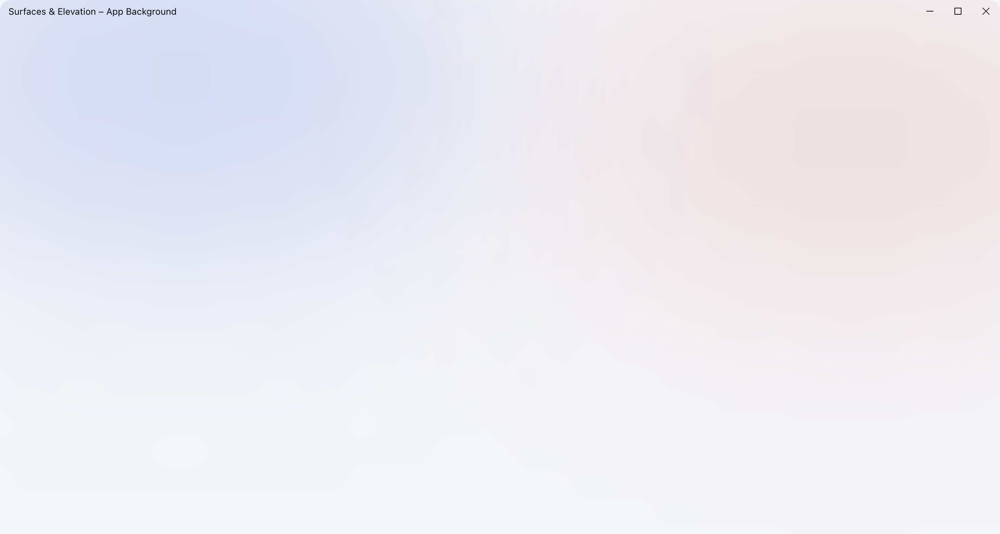

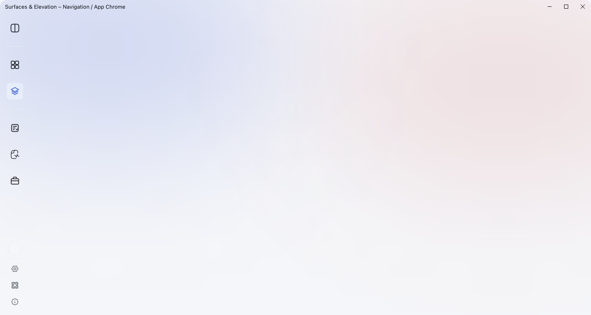

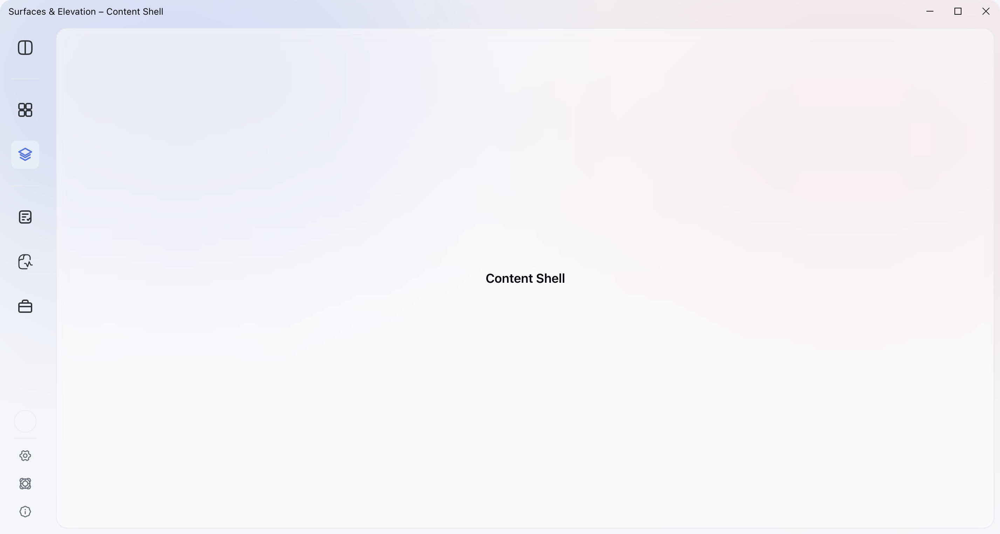

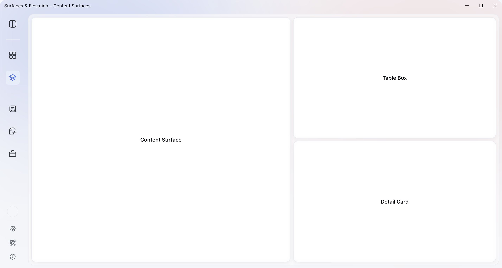

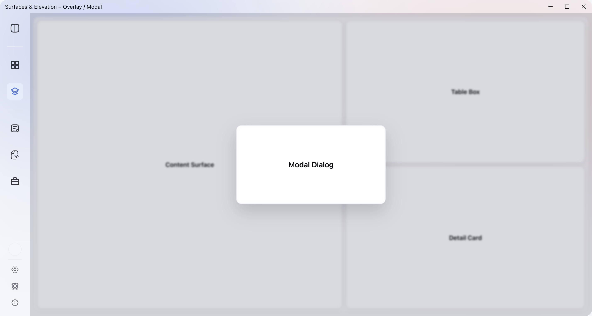

### Container-Typen

| Typ | Fläche | Zweck | Scroll-Verhalten | Beispiele |
|---|---|---|---|---|
| App Background | neutraler Hintergrund | Raum, Kontext, Abstand | nie selbst | App-Hintergrund |
| Navigation / App Chrome | transparent bis `--glass-toolbar` | Navigation und App-Rand | nie selbst | Sidebar, Topbar |
| Content Shell | `--glass-toolbar` / Glass | Arbeitsraum halten | selten, nur als Viewport | Hauptbereich um Inhalte |
| Solid Content Surface | `--color-surface-default` | Lesen, Arbeiten, Daten halten | je nach Pattern | Detailseite, Liste, Settings-Table |
| Overlay / Modal | Scrim plus Solid/Glass Overlay | temporäre Entscheidung | eigener Kontext, wenn nötig | Modal, Popover, Floating Footer |

### Grundsatz: Nicht Alles Scrollt

Es darf pro Achse nur einen primären Scroll-Owner geben. Mehrere verschachtelte Scrollbereiche fühlen sich technisch an und erschweren Orientierung.

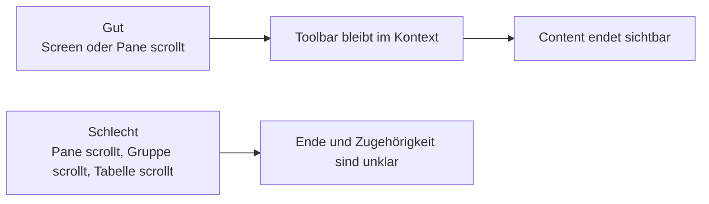

### Pattern A: Geschlossener Arbeits-Pane

Für produktive Split-Views mit einer langen Liste und festem Detailbereich. Der Pane hat eine definierte Höhe; die Toolbar bleibt oben; nur der Listenbody scrollt.

```text
Content Shell
┌──────────────────────┬──────────────────────────────┐
│ List Panel            │ Detail Panel                   │
│ ┌──────────────────┐ │ ┌──────────────────────────┐ │
│ │ Filter / Chips   │ │ │ Header / Actions          │ │
│ ├──────────────────┤ │ ├──────────────────────────┤ │
│ │ Scroll Body      │ │ │ Detail Content            │ │
│ │ Group            │ │ │                          │ │
│ │ Row              │ │ │                          │ │
│ │ Row              │ │ │                          │ │
│ └──────────────────┘ │ └──────────────────────────┘ │
└──────────────────────┴──────────────────────────────┘
```

Anwenden, wenn:

- die Liste ein Werkzeug ist, nicht ein Dokument
- Filter/Suche dauerhaft verfügbar bleiben müssen
- Master und Detail gleichzeitig sichtbar sein sollen
- der User wiederholt scannt, auswählt und vergleicht

Aktueller Referenzfall: Übergabebuch auf Desktop.

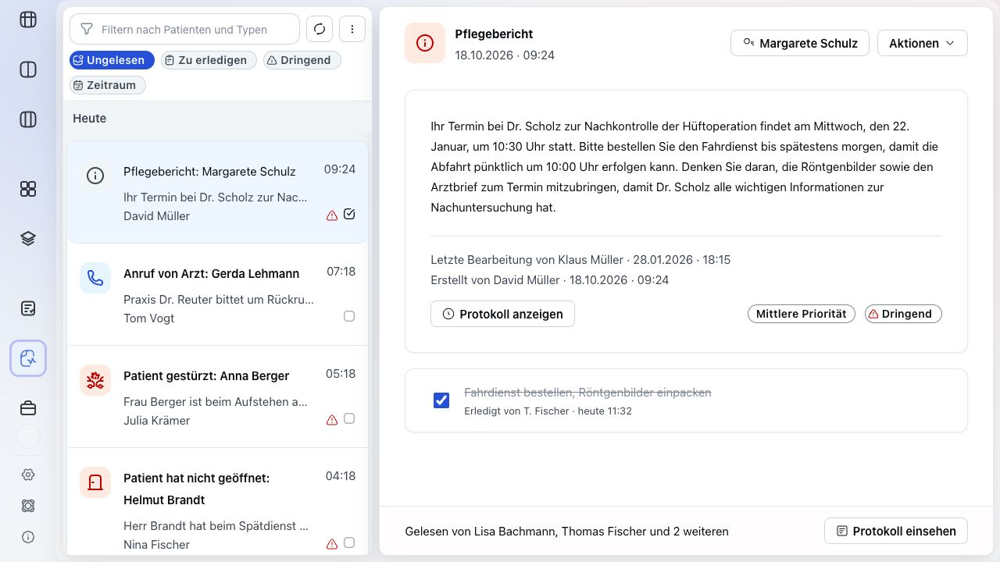

### Pattern B: Organische Inhaltsfläche

Für dokumentartige Seiten, Einstellungsbereiche und lange Formulare. Container sind so hoch wie ihr Inhalt; der Screen oder die App-Shell entscheidet, ob gescrollt wird.

```text
Screen Scroll
┌──────────────────────────────────────────────┐
│ Page Header                                  │
│                                              │
│ ┌──────────────────────────────────────────┐ │
│ │ Content Block                            │ │
│ │ Row                                      │ │
│ │ Row                                      │ │
│ └──────────────────────────────────────────┘ │
│                                              │
│ ┌──────────────────────────────────────────┐ │
│ │ Next Content Block                       │ │
│ │ ...                                      │ │
│ └──────────────────────────────────────────┘ │
└──────────────────────────────────────────────┘
```

Anwenden, wenn:

- das Ende eines Containers sichtbar und semantisch wichtig ist
- Inhalte linear gelesen oder bearbeitet werden
- keine dauerhafte parallele Detailansicht gebraucht wird
- der Screen eher "Seite" als "Werkzeugpane" ist

Referenzfälle: Einstellungen, Detailseiten, spätere Mobile-Stacks.

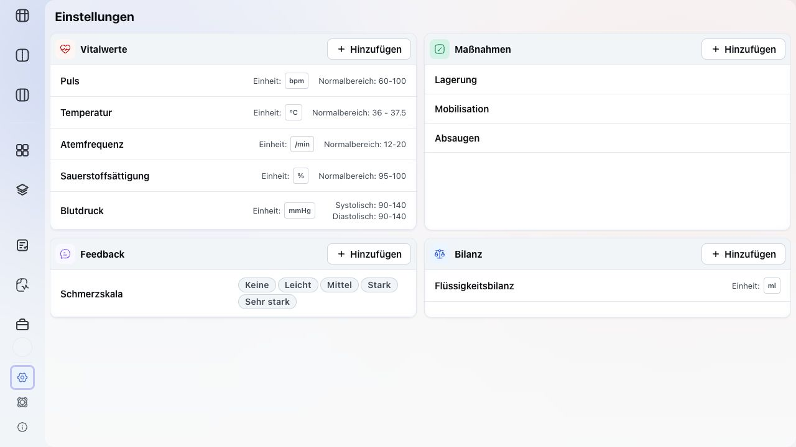

### Pattern C: Sticky Toolbar Über Organischem Content

Nur verwenden, wenn der Screen selbst scrollt und die Steuerung wirklich dauerhaft verfügbar bleiben muss. Dann braucht die Toolbar eine opake Fläche und eine saubere Clip-/Maskenstrategie, sonst laufen Inhalte sichtbar darunter durch.

```text
Screen Scroll
┌──────────────────────────────┐
│ Sticky Toolbar               │  bleibt oben
├──────────────────────────────┤
│ Content Block                │
│ Content Block                │
│ Content Block                │
└──────────────────────────────┘
```

Regeln:

- Sticky Toolbars sind Chrome, nicht Content.
- Sticky Toolbars brauchen eine deckende Hintergrundfläche.
- Darunterliegender Content darf visuell nicht durch Radius-Ecken oder Glass scheinen.
- Wenn das Masking kompliziert wird, ist meistens Pattern A besser.

Grid-Referenz ohne eigenen Inner-Scroll: Das Messblatt nutzt eine großflächige Content Surface mit festen Spalten und Row-Auswahl als Interaction State.

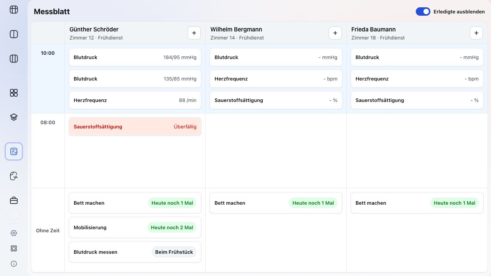

### Radius- und Nesting-Regeln

- Eine Content Surface bestimmt die äußere Rundung.
- Interne Gruppen dürfen nur dann eigene Rundung haben, wenn sie eigenständig wahrgenommen werden sollen.
- Rows innerhalb einer Gruppe teilen sich die Gruppenrundung: erste Row oben rund, letzte Row unten rund.
- Ausgewählte Rows dürfen alle vier Ecken rund haben, weil sie temporär aus der Gruppe heraustreten.
- Keine Card in Card, wenn beide nur der visuellen Rahmung dienen.
- Header innerhalb einer Box sind meist `--color-surface-subtle`, nicht eine zweite weiße Card.

### Scroll-Entscheidung

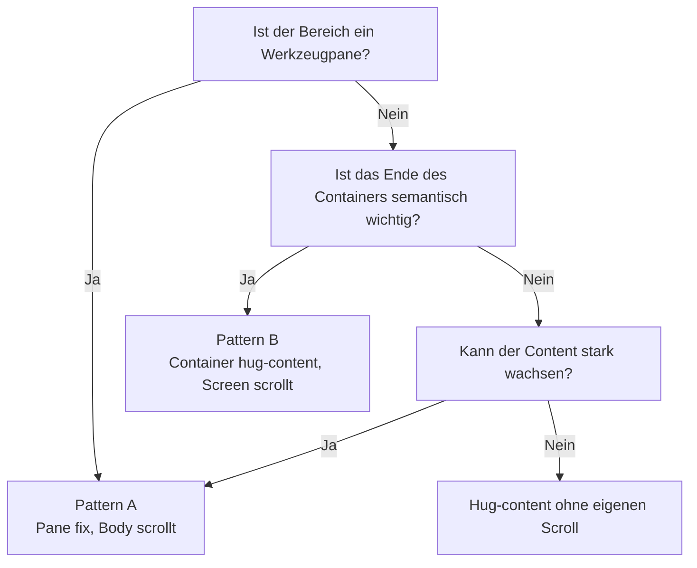

### Offene Responsive-Regel

Desktop darf mehrere Container nebeneinander zeigen. Mobile und kleine Tablets sollten dieselbe Informationsarchitektur als Stack zeigen:

- Master-Detail wird Navigation Stack.
- Pane-Scroll wird Screen-Scroll.
- Toolbars werden Top-Bar oder Bottom Action Bar.
- App-spezifische Brand-Farben ändern nur Brand-/Accent-Tokens, nicht Container-Logik.

## Naming-Konventionen

Drei-Ebenen-Hierarchie, identisch zu `/Users/benjaminlau/Documents/DesignSystem` (STYLEGUIDE.md):

1. **Global** – rohe Skalenwerte, kein Bedeutungsbezug: `--primary-500`, `--neutral-900`, `--space-md`. Nie direkt in Komponentenregeln.
2. **Semantic** – Rolle statt Wert, Präfix `--color-*`: `--color-text-primary`, `--color-brand-default`. Wird in Dark Mode überschrieben; Component-Tokens erben automatisch.
3. **Component** – konkrete Anwendung an einem Baustein: `--button-primary-background-default`, `--card-border`, `--input-border-focus`.

Beide Projekte (DesignSystem-Doku und desktopLayout-App) nutzen ab jetzt exakt dieselben Global- und Semantic-Namen, damit keine zwei Wahrheiten mehr auseinanderlaufen.

## Entscheidungsprotokoll

- **Token-Grundgerüst (Schritt 1+2):** `desktopLayout/src/renderer/tokens.css` auf die drei Ebenen umgebaut, 1:1 nach dem Vorbild von `DesignSystem/styles.css`. Alte, flache Tokennamen (`--text-primary`, `--surface-default` etc.) bleiben vorerst als Alias auf die neue Semantic-Ebene erhalten – kein Big-Bang-Rename, `style.css` läuft unverändert weiter. Der Dark-Mode-Block überschreibt jetzt ausschließlich Semantic-Tokens (`--color-*`); Component-Tokens erben automatisch.
  - **Nebenbefund behoben:** die alte Kollision `--border-subtle == --surface-default` im Dark Mode (beide zeigten auf dieselbe Neutral-Stufe) ist strukturell weg, weil DesignSystems Dark-Mapping für beide unterschiedliche Stufen nutzt (`neutral-700` vs. `neutral-800`) – die vorherige Ad-hoc-Anhebung von `--border-subtle` ist damit hinfällig.
  - **Entschieden (2026-08-04):** `--color-surface-subtle` und die rein präsentationalen `--glass-toolbar/-card/-solid/-strong` bleiben dauerhaft Teil des gemeinsamen Systems, mit desktopLayout als Quelle. Begründung: desktopLayout ist auf absehbare Zeit die einzige App, die das System nutzt – DesignSystem bleibt konsequent Doku *für* desktopLayout, nicht eine parallele, unabhängige Definition.
  - **Bei der Prüfung festgestellt: technisch bereits gelöst.** Das DesignSystem-Repo hat seit dem Commit "Sync token pipeline..." eine eigene Automatik (`scripts/sync-project-tokens.mjs`): `desktopLayout/src/renderer/tokens.css` wird 1:1 nach `DesignSystem/assets/project-tokens.css` kopiert, `index.html`/`navigation.html` laden diese Datei als echtes `<link>` **vor** `styles.css`, wodurch alle Tokens (auch `--color-surface-subtle` und `--glass-*`) dort automatisch als CSS-Variablen verfügbar sind, ohne Werte-Duplikat in `styles.css`. `node scripts/sync-project-tokens.mjs --check` bestätigt: kein Drift. Der offene Punkt war also nur noch in diesem Protokoll offen, nicht mehr im Code.
  - **Offener Punkt:** `--danger-600` (#dc2626) und `--text-danger` (#b91c1c) liegen auf keiner Figma-Skalenstufe – historisch eigenständige Werte. Bleiben vorerst literal; Schritt 8 entscheidet, ob sie auf `--color-status-error` vereinheitlicht werden.

- **Primary-Button (Schritt 3):** `.btn--primary` nutzt jetzt `--button-primary-background-default` (Brand-Blau) statt `--accent-500` (Rot). Nebenbefund: das Modal-„Übernehmen"-Feedback-Button war laut ursprünglichem Figma-Design schon immer als Blau geplant, lief aber über die (rote) `.btn--primary`-Klasse – der Fix behebt das automatisch mit.

- **Radius-Skala (Schritt 4):** desktopLayout behält seine Werte (sm/md/lg/full = 4/6/12/9999px) – die App wird nicht angepasst. Stattdessen wurde `DesignSystem/styles.css`, `STYLEGUIDE.md` und die Radius-Referenztabellen in `DesignSystem/index.html` auf diese Werte korrigiert. Damit ist DesignSystem jetzt die Doku *für* desktopLayout, nicht eine parallele eigene Definition.
  - **Offener Punkt (→ Schritt 8):** unsere Buttons hartkodieren `border-radius: 8px` direkt statt `var(--radius-md)` (6px) zu nutzen – interne Inkonsistenz innerhalb von desktopLayout selbst, nicht Teil dieser Entscheidung. Wird in Schritt 8 zusammen mit der generellen Component-Token-Migration gelöst.

- **Schriftfamilie (Schritt 5):** desktopLayout behält Open Sans (Headings/Body) + Roboto (nur Badges) – keine Änderung an der App. DesignSystem korrigiert: `body`-Font-Stack in `styles.css` von Inter auf Open Sans umgestellt, Typography-Referenztabelle in `index.html` zeigt jetzt "heading/body → Open Sans", "badge → Roboto" statt "Inter"/"System UI". STYLEGUIDE.md erwähnte die Fontfamilie nicht namentlich, kein Update nötig.
  - **Nebenbefund:** beide Projekte deklarieren ihre Font-Familie nur in CSS, laden sie aber nirgends aktiv (kein `@font-face`/Google-Fonts-Link) – rendert also nur korrekt, wenn die Schrift lokal installiert ist, sonst Fallback auf System-Sans. Betrifft beide Systeme gleichermaßen, keine neue Lücke durch diese Änderung.

- **Font-Weight-Tokens (Schritt 6):** `--font-weight-regular/medium/semibold/bold/extrabold/black` (400–900) existierten schon aus Schritt 1. Alle 15 hartkodierten `font-weight`-Zahlen in `style.css` auf die Tokens migriert (nur 400/500/600/700 kamen tatsächlich vor).
- **Focus-Ring (Schritt 7):** `--color-focus-ring` (aus Schritt 1) jetzt an `.btn`, `.sidebar-icon`, `.menu-item`, `.breadcrumb-pill`, `.list-row` und Text-Inputs verdrahtet, nur bei `:focus-visible` (Tastatur), via `outline` statt `box-shadow` um die mehrschichtigen Button-Bevel-Schatten nicht zu überschreiben. Per Tab-Taste visuell bestätigt.

- **Component-Tokens tatsächlich genutzt (Schritt 8):** Buttons (primary/secondary/ghost/destructive), Card (`.detail-view__card`, `.modal__card`), Chip, Form-Input und Filter-/Such-Inputs nutzen jetzt die Component-Tokens aus Schritt 1 statt Global/Semantic-Referenzen direkt oder Hardcodes.
  - **Radius-Ausreißer aufgelöst:** 12 Stellen hartkodierten bereits `8px` als "medium radius" (Buttons, Chips, Modal-Card, Inputs …), während `--radius-md` bei `6px` stand. Der Token war der Fehler, nicht die App – `--radius-md` auf `8px` angehoben, alle 12 Stellen plus `--radius-lg` (12px, 9 Stellen) und `--radius-sm` (4px, 3 Stellen) auf die Tokens gezogen. Keine sichtbare Änderung, reine Tokenisierung.
  - **Pills-Regel nachgezogen:** einfacher `.chip` (Tag-Style) nutzte `--radius-md`, jetzt wie `.chip--status` auf `--radius-full` – deckt sich jetzt mit der kanonischen Shape-Regel "Pills nutzen full radius".
  - **Zweiter Accent/Brand-Fund:** der ausgewählte Sidebar-Eintrag (`.sidebar-icon--selected`) nutzte wie der Primary-Button vorher Accent/Rot für seine "aktiv"-Kennzeichnung statt Brand/Blau (`--nav-item-text-active`). Gleiche Begründung wie Schritt 3, direkt mit korrigiert statt erneut nachzufragen.
  - **Component-Token-Definitionen an Realität angepasst statt umgekehrt** (analog zum Radius-Vorgehen): `--button-secondary-border` zeigt jetzt auf `--color-border-subtle` statt kanonisch `--color-border-default`; `--button-secondary-background-hover`/`--button-ghost-background-hover` zeigen auf `--color-surface-subtle` (unser eigener Slot) statt kanonisch `--color-surface-raised`.
  - **Bewusst nicht migriert:** `.btn--destructive`s Hintergrund/Rahmen (halbtransparentes Rot-Overlay per rgba-Alpha) und die opazitätsbasierten `:disabled`-Zustände – andere visuelle Technik als die kanonischen soliden Component-Tokens, Migration hätte den Look verändert statt nur umzubenennen. Bleibt bewusst literal.

- **Dark-Mode-Proportionalität nachgeschärft:** Prinzip festgehalten – Kontrast-*Verhältnisse* zwischen zusammengehörigen Rollen (Text/Hintergrund, Rahmen/Fläche, Fläche/Fläche) sollen in Light und Dark ähnlich bleiben, nicht die Hex-Werte gespiegelt werden. Per WCAG-Kontrastformel nachgerechnet (Skript in `/tmp`, nicht Teil des Repos) – die meisten Paare (Text-Hierarchie, Status-Farben, Brand-Button) waren schon proportional. Zwei Ausreißer gefunden:
  - `surface-raised` vs. `background-secondary`: Light identisch (`#f4f6f9`, Kontrast 1.00), Dark deutlich unterschiedlich (Kontrast 1.33) – behoben durch neue Skalenstufe `--neutral-25` (`#fafbfc`), `--color-surface-raised` (Light) zeigt jetzt darauf statt auf `--neutral-50`. In beiden Projekten (desktopLayout `tokens.css` + DesignSystem `styles.css`) ergänzt. Kontrast danach: 1.045 (Karten-Definition kommt in Light ohnehin primär über Schatten, nicht Flächenfarbe – daher bewusst subtil, nicht 1:1 auf Darks 1.33 gezogen).
  - `surface-default` vs. `background-secondary`: umgekehrtes Muster (Light unterschiedlich: Weiß vs. `#f4f6f9`; Dark identisch: beide `neutral-800`) – als bekannter, noch offener Punkt festgehalten, nicht mit korrigiert (siehe unten).
  - **Grundprinzip, warum Light "flacher" sein darf:** Light-Mode-Elevation läuft bei uns primär über Drop-Shadows (`.panel`, `.modal__card` haben eigene `box-shadow`), Dark-Mode-Elevation zwangsläufig über Flächenhelligkeit (Schatten sind auf dunklem Grund kaum sichtbar). Ziel ist also nicht identische Zahlenverhältnisse, sondern dass die Elevation-Hierarchie in beiden Modi gleich klar erkennbar ist – nur mit unterschiedlichen Mitteln.

- **Button-/Modal-Bevel-Schatten waren nicht invers, sondern komplett unangetastet (2026-07-28):** `.btn--primary/--secondary/--destructive`, `.modal`, `.modal__card` und `.list-row__badge` hatten seit jeher literale, fest codierte `rgba()`-Bevel-Werte (weißes Inset-Highlight + farbig/schwarz getönter Ambient-Schatten über eine `--shadow-color`-Variable pro Klasse) – für diese Werte existierte **gar kein** Dark-Mode-Zweig, anders als bei `--shadow`/`--shadow-soft` (Schritt "Dark-Mode-Proportionalität"). Zwei Effekte kamen zusammen und ergaben den "invers/falsch"-Eindruck:
  - Der Ambient-Schatten ist literal `rgba(0, 0, 0, X)`/`rgba(6, 9, 14, X)` bzw. eine dunkle Formfarbe – auf `--neutral-900` (`#06090e`, fast Schwarz) hat das praktisch keinen Helligkeits-Delta mehr, der Schatten verschwindet.
  - Das Inset-Highlight bleibt dagegen bei voller Light-Mode-Deckkraft (0.4–0.7) bestehen, weil es nicht vom (fehlenden) Dark-Zweig betroffen ist – auf den jetzt helleren/gesättigteren Dark-Mode-Buttons (Brand verschiebt sich auf `primary-400`) wirkt eine so kräftige weiße Kante wie ein Leuchtrand statt einer feinen Kante. Das Zusammenspiel – Schatten weg, Highlight unverändert kräftig – ist der "das sieht invertiert aus"-Effekt.
  - **Fix:** zwei neue Semantic-Tokens `--shadow-highlight-factor` und `--shadow-ambient-factor` (Light: je `1`, unverändert). Alle betroffenen `box-shadow`-Deklarationen multiplizieren ihre bestehenden Alpha-Werte jetzt per `calc()` mit diesen Faktoren, statt die Werte zu verdoppeln/duplizieren – Verhältnis zwischen default/hover/active bleibt dadurch automatisch erhalten (reine Skalierung, kein Value-Redesign). Dark: `--shadow-highlight-factor: 0.3` (Highlight bleibt sichtbar, aber deutlich gedimmt), `--shadow-ambient-factor: 0` (Ambient-Schatten ausgeblendet statt auf einen unsichtbaren Wert zu verharren – Elevation kommt im Dark Mode ohnehin über die Flächenhelligkeit, nicht über Cast-Shadows, s.o.).
  - **Nebenfund gleicher Ursache:** `.list-row:hover`/`.list-row--selected` nutzten literales `rgba(43, 91, 220, 0.35)` bzw. `var(--primary-500)` (Global-Tier, per Namenskonvention nie direkt in Komponentenregeln) für den Auswahl-/Hover-Ring – dadurch blieb der Ring im Dark Mode am Light-Mode-Blau (`primary-500`) hängen, obwohl `--color-brand-default` dort auf `primary-400` wechselt. Neues Token `--color-brand-ring` (Semantic, mit Dark-Wert auf `primary-400`-RGB) ersetzt die literale Ringfarbe; `.list-row--selected` zeigt jetzt auf `--color-brand-default` statt auf den Global-Token.
  - Visuell verifiziert: Dark Mode, Components-View (Primary/Secondary/Löschen-Button), Modal ("Feedback erfassen"), Patientenliste (Selected-Row-Ring) – Light Mode unverändert, da `calc(x * 1)` mathematisch identisch zum vorherigen literalen Wert ist.

- **`--glass-elevation-glow` (innerer "Glasglanz" an Panel/List-Group/Settings-Section) war die gleiche Bug-Klasse, nur unabhängig von den Buttons entdeckt (2026-07-28):** Farbe ist in Light *und* Dark immer `rgb(244, 246, 249)` (nie invertiert) – das war schon richtig so, der Glanz soll ja immer hell/weißlich wirken. Das Problem war die Opazität: Light 0.35 auf weißem Panel-Hintergrund (`--color-surface-default` = `--neutral-white`) ergibt einen Kontrast von nur **1.03** (WCAG-Formel) – praktisch unsichtbar, der Glanz war in Light Mode nie ein wahrnehmbares Element, nur ein Nebeneffekt. Der bisherige Dark-Wert 0.16 auf `--neutral-800` (`#181d25`) ergibt dagegen **1.61** – ein deutlich sichtbarer heller Rand um jedes Panel, weil die gleiche fast-weiße Farbe auf dunklem statt auf hellem Grund viel mehr Delta erzeugt. Gleiches Muster wie beim Button-Highlight: unveränderte/kaum reduzierte Deckkraft auf einem strukturell viel dunkleren Untergrund wirkt unverhältnismäßig kräftiger.
  - **Erster Fix (verworfen):** `--glass-elevation-glow` zunächst an `--shadow-highlight-factor` gekoppelt (0.35 × 0.3 ≈ 0.105, Kontrast ~1.34) – laut Rückmeldung ("ist mir noch zu shiny") immer noch spürbar.
  - **Finaler Fix:** eigener, separater Token `--glass-glow-factor` (Light `1`, Dark `0.1`) statt Kopplung an die Button-Kurve – der Glow auf großen Panel-Flächen braucht deutlich mehr Dimmung als die kleine Button-Kante, beide Effekte sollten nicht an derselben Stellschraube hängen. Ergebnis: 0.35 × 0.1 = 0.035 Alpha, Kontrast ~1.09 gg. `neutral-800` – nur noch ein Hauch, praktisch die gleiche Zurückhaltung wie in Light Mode (1.03), statt eine kompensierende "Extra-Portion" Glanz für den fehlenden Drop-Shadow zu behalten.

- **Erster echter Feature-Test des Design Systems: "Beispiel: Patientenliste" → Übergabebuch (2026-07-28):** bisher war die Ansicht 100% Mock (7x identischer Eintrag "Michael Schneider", Detail nur graue Platzhalter-Balken, Status alternierte nur nach Zeilennummer). Auf Wunsch des Nutzers ("das ist unser Übergabebuch") auf ein echtes Datenmodell umgestellt: 7 reale, unterschiedliche Einträge (Patient, Kategorie, Notiztext, Autor, Datum relativ zu "jetzt" berechnet statt fester Kalenderdaten, Status offen/erledigt, dringend-Flag). Liste wird jetzt komplett aus den Daten gerendert (`renderList()` in `renderer.js`), nicht mehr hartkodiertes HTML.
  - **Bestandene Stresstests für bestehende Komponenten/Tokens:** `.sidepanel-item`/`.sidepanel-item__label`/`.sidepanel-item__value` (bisher nur in Layout 5/Leistungsübersicht genutzt) ließ sich 1:1 in der Detail-Ansicht der Patientenliste wiederverwenden (neuer Container `.detail-view__fields`) – gutes Zeichen, dass das Label/Value-Pattern generisch genug ist. `chip--success`/`chip--warning` (aus der Components-Demo) für den Status-Chip direkt nutzbar, inkl. Klassenwechsel je nach echtem Status (vorher hing die Chip-Farbe nie am Status, nur der Text). `list-row--accent`/`list-row--primary` bekommen jetzt echte Bedeutung (dringend vs. normal) statt nur zwei Farbvarianten zu demonstrieren.
  - **Bewusst nicht Teil dieses Schritts:** neuer Eintrag erfassen, als erledigt markieren, Filtern – Nutzer hat "echtes Datenmodell zuerst" priorisiert, Interaktionen folgen in einem späteren Schritt.

- **Datenmodell auf reale Produktiv-Struktur präzisiert (2026-07-28):** Nutzer hat einen echten Screenshot + die echte Typen-Einstellungsseite (26 Typen mit Icon + Priorität: Information/Normal/Wichtig) geliefert. Ursprüngliches Modell (erfundene "Kategorie" Medikation/Pflege/Termin/Allgemein, Status offen/erledigt) durch das echte Modell ersetzt: **Typ** (aus der realen 24-Typen-Liste, je mit Priorität + Icon – mehrere Typen teilen sich bewusst ein Icon, genau wie im Original, z.B. alle "Anruf von..."-Typen), **Bezug** (Patient/Pfleger – ein Eintrag kann auch den Pfleger selbst betreffen, nicht nur den Patienten, siehe Autounfall-Beispiel), **Priorität** und **Dringend** als zwei unabhängige Signale statt einem einzigen Status (Dringend ist nicht an eine Priorität gebunden), **Gelesen** (Bool) statt "erledigt", optionale **Todos** pro Eintrag (Checkbox-Liste).
  - **Icons sind bewusst keine 1:1-Kopie** der echten Assets (lagen nicht vor, nur ein PDF-Screenshot der Einstellungsseite) – eigene, konzeptionell passende Annäherungen. Für die Struktur-/Token-Fragen (worum es hier geht) ist das ausreichend, für den echten Produktivbetrieb bräuchte es die echten Icon-Dateien.
  - **Neuer, wiederverwendbarer Fund:** `hidden`-Attribut wurde an drei Stellen (`.detail-view__todos`, `.detail-view__footer`, `.chip--icon`) von einer eigenen `display: flex`/`inline-flex`-Regel überschrieben – Autor-Stylesheets gewinnen immer gegen die User-Agent-Regel `[hidden] { display: none }`, unabhängig von Spezifität. **Regel für künftige Utility-Klassen:** jede Klasse, die `display` unconditional setzt und potenziell mit dem `hidden`-Attribut kombiniert wird, braucht eine eigene `.klasse[hidden] { display: none; }`-Zeile – sonst bleibt das Element trotz `hidden = true` sichtbar.

- **Dark-Mode-Asymmetrie `surface-default`/`background-secondary` behoben (2026-08-04):** war die spiegelverkehrte Variante des surface-raised-Funds – dort Light identisch/Dark unterschiedlich, hier Dark identisch (beide `neutral-800`, Kontrast 1.00) / Light unterschiedlich (Weiß vs. `neutral-50`, Kontrast ~1.08). Praktisch relevant, weil `--color-background-secondary` über den Legacy-Alias `--color-slate-100` der tatsächliche App-Hintergrund ist (`html, body` in style.css) und `--color-surface-default` mit 29 Verwendungsstellen der Haupt-Content-Surface-Token – Ebene 3 (Content Surface) war im Dark Mode farblich nicht von Ebene 0 (App Background) zu unterscheiden.
  - **Fix:** neue Zwischenstufe `--neutral-750` (`#1e242d`, zwischen `neutral-700` und `neutral-800`) eingeführt, analog zu `--neutral-25` beim surface-raised-Fix. `--color-surface-default` zeigt im Dark-Block jetzt auf `--neutral-750` statt `--neutral-800`; `--color-background-secondary` bleibt unverändert Anker. Ergebnis: Kontrast ~1.09, nah an Light. Nebeneffekt: die Elevation-Leiter ist damit im Dark Mode wieder lückenlos monoton (`background-secondary` 800 < `surface-default` 750 < `surface-raised` 700 < `surface-overlay` 600), vorher lagen `background-secondary` und `surface-default` auf derselben Stufe.
  - Light Mode unverändert.

- **Selected-Row-Hintergrund in Dark Mode gefixt (2026-08-04):** gleiche Bug-Klasse wie Button-Highlight/Glass-Glow, live beim Testen im Übergabebuch aufgefallen ("active color funktioniert noch nicht so"). `--state-selected-background` mischte in Dark `primary-900` (`#000030`, fast Schwarz) bei 72% – dunkler als die Fläche darunter (`--color-surface-default` = `neutral-750`), die Selektion wirkte dadurch eher wie eine Abdunkelung als eine Hervorhebung. Der Rahmen (`--state-selected-border`, `primary-400`) war schon korrekt hell.
  - **Fix:** `primary-400` (gleiche Familie wie der Rahmen) bei 18% Opazität statt `primary-900` bei 72%. Liegt jetzt klar heller als die Umgebungsfläche, konsistent mit dem Prinzip "höhere Elevation = heller" aus dem surface-default-Fix. Optisches Feintuning der 18% ggf. nötig (kein Live-Rendering zur Verifikation verfügbar) – gleiches Vorgehen wie beim glass-glow-Fix.
  - **Verwandter Fund, bewusst nicht mitgefixt:** `--color-brand-subtle` (Light `primary-50` / Dark `primary-900`) hat dieselbe Spiegel-Logik und wird an 5 Stellen in style.css als Fläche genutzt, u.a. `--nav-item-background-active` – potenziell derselbe Bug, aber nicht Teil dieser Anfrage. Siehe Todoist.

- **Component: Tooltip gebaut (2026-08-04):** erste Component aus dem Figma-Abgleich, die im Code komplett fehlte. Umgesetzt als ein einziges, wiederverwendetes DOM-Element (`js/ui/tooltip.js`, `initTooltips()`), das an jedes `[data-tooltip="Text"]`-Element angehängt wird – kein Element bekommt sein eigenes Tooltip-DOM, spart Duplikate.
  - **Zweck:** rein ergänzende, nicht-kritische Information. Kein interaktiver Inhalt (Links/Buttons) – dafür ist ein Popover/Menu zuständig, kein Tooltip.
  - **Trigger:** Hover *und* Keyboard-Focus (`focus`/`blur`), nie Klick. Erscheint nach 450ms Verzögerung, verschwindet sofort ohne Delay. Escape schließt es jederzeit.
  - **Positionierung:** Standard oberhalb des Triggers, klappt automatisch nach unten bei Kollision mit dem oberen Viewport-Rand; horizontal an den Viewport-Rändern geclamped. Scroll/Resize verstecken es (keine Live-Neupositionierung, konsistent mit "verschwindet sofort").
  - **A11y:** `role="tooltip"` + `aria-describedby` vom Trigger, nur während sichtbar gesetzt.
  - **Nebenbefund im Zuge dessen behoben:** `.btn` nutzte für Disabled-Buttons ausschließlich `:disabled` – native `disabled`-Buttons sind nicht fokussierbar, ein Tastatur-Nutzer hätte ein Tooltip an so einem Button also nie gesehen (Widerspruch zur eigenen Tooltip-Regel "Trigger = Hover UND Focus"). Alle vier Button-Typen (`primary/secondary/ghost/destructive`) unterstützen jetzt zusätzlich `aria-disabled="true"` als fokussierbare Alternative, mit identischem visuellem Deaktiviert-Look; `:hover`/`:active` sind für diesen Zustand neutralisiert. Echtes Klick-Verhindern (bei tatsächlicher Funktionalität statt Demo) ist noch ein offener Anwendungs-Punkt, kein CSS-Thema.
  - **Tokens:** nutzt die bereits vorhandenen, bis dahin ungenutzten `--tooltip-background`/`--tooltip-text` sowie `--shadow-floating`, `--radius-sm`, `--type-meta` – keine neuen Farb-Tokens nötig.
  - **Demo:** Components-Screen, neue Sektion "Tooltip" (IconButton + ein `aria-disabled`-Button mit Begründungstext).
  - **Für Figma-Rückfluss (Beschreibungstext):** "Tooltip – kurzer, rein informativer Hinweistext zu einem Element. Erscheint bei Hover oder Tastatur-Fokus mit kurzer Verzögerung, verschwindet sofort. Enthält nie interaktive Inhalte oder kritische Information."

- **Doku-Bausteine für mehr visuelle Klarheit (2026-08-04):** auf Wunsch, die DesignSystem-Doku grafischer zu machen (Do's/Don'ts, echte Screenshots statt nur Text).
  - **Do's & Don'ts:** neuer wiederverwendbarer Baustein `.component-dos-donts` in `DesignSystem/navigation.css` (zwei Karten, grün/rot über dieselben `--color-status-success/-error`-Tokens wie `.status-badge`, kein neuer Farbwert). Erste Anwendung auf der Tooltip-Seite: Do = kurzer Info-Text, Don't = Link/kritische Info im Tooltip.
  - **Screenshot-Pipeline generalisiert:** `scripts/capture-surface-screenshots.js` (fest verdrahtet auf die 5 Elevation-Stufen) hat jetzt ein generisches Geschwister-Skript `scripts/capture-component-screenshots.js` – Shots werden als Liste konfiguriert (View wechseln, optionales Setup-JS z.B. echtes `.focus()` um den Tooltip-Trigger zu triggern, optionaler Zuschnitt auf einen Selector statt ganzes Fenster). Neue npm-Scripts `capture:surfaces`/`capture:components`.
  - **Nicht selbst ausführbar:** das `electron`-Paket im Projektordner ist die macOS-Variante, im Sandbox-Linux-Environment nicht lauffähig (`not found`/Syntax-Error beim Start) – muss lokal auf dem Mac laufen, siehe Todoist-Task.
  - **Entscheidung, wann Screenshot vs. Live-HTML:** Screenshots für "sieht so aus/sieht so falsch aus"-Fälle (Do's/Don'ts, Elevation, Container-Patterns), Live-HTML-Nachbau für Component-Anatomie/States, wo Interaktivität den Punkt macht (z.B. Tooltip-Preview-Tab bleibt Live-HTML, ist aber kein Widerspruch zu Screenshots an anderer Stelle derselben Seite).

- **Component: IconButton geprüft & vervollständigt (2026-08-04):** anders als die Audit-Notiz vermutete, existierte `.btn--icon` schon als generisches, an 15+ Stellen wiederverwendetes Primitive (Kombination mit `.btn--primary/-secondary/-ghost/-destructive`) – die eigentliche Lücke war nicht "Component fehlt", sondern zwei von Figmas sechs States (Default/Hover/Pressed/Disabled/Active/Tooltip) waren nicht sauber abgebildet:
  - **Tooltip-State:** jetzt über das neue `data-tooltip`-System abgedeckt (siehe Tooltip-Eintrag oben), am "Mehr Optionen"-Button in der Components-Demo verdrahtet.
  - **Active-State war mit Pressed verwechselt:** die DesignSystem-Doku nannte den `:active`-Pseudo-Klassen-Zustand (Mausklick, momentan) "Active" – das ist aber Figmas "Pressed". Figmas echtes "Active" (dauerhaft eingeschalteter Modus, z.B. Auto-Refresh an) gab's im Code nur als loses, undokumentiertes `.btn.is-active` (gefunden in `toolbar-actions__search.is-active` context), nirgends für Icon Buttons demonstriert. Alle vier "Active"-Zeilen in der Doku (Primary/Secondary/Ghost/Destructive) auf "Pressed" umbenannt, neuer eigener "Active"-Abschnitt ergänzt.
  - **Toggle-Semantik nachgezogen:** neuer Demo-Button ("Automatisch aktualisieren") nutzt `.is-active` **plus** `aria-pressed="true"` – ein rein visueller Toggle ohne ARIA-Signal wäre für Screenreader unsichtbar gewesen. Als neue Accessibility-Regel dokumentiert.
  - **Bekannte, bewusst nicht mitgefixte Abhängigkeit:** `.is-active` nutzt `--color-brand-subtle` für den Hintergrund – derselbe Dark-Mode-Bug (Light `primary-50`/Dark `primary-900`, dunkler statt heller) wie beim schon gefixten Selected-Row-Hintergrund. Als Warnhinweis in der Doku vermerkt, Fix bleibt der bereits offene Todoist-Task.
  - **Do's & Don'ts ergänzt** (zweite Anwendung des neuen Bausteins): Do = `aria-label` gesetzt, Don't = nur `data-tooltip` ohne `aria-label`.

- **Tooltip-Positionierung geändert + zwei neue Icon-Button-Regeln (2026-08-04):** Positionierung von "oberhalb, klappt nach unten" auf "rechts neben dem Trigger mit leichtem Down-Offset (2px), klappt bei Kollision nach links" umgestellt (`js/ui/tooltip.js`, Konstante `DOWN_OFFSET`). DesignSystem-Doku hatte den neuen Wert (`.tooltip-demo .tooltip { margin-top: 2px }`) schon spezifiziert – Code jetzt exakt darauf abgestimmt, damit App und Doku-Preview übereinstimmen.
  - **Tooltip bei Icon Buttons: optional → Pflicht.** `aria-label` deckt nur Screenreader ab; ohne Tooltip hat ein sehender Maus-/Tastatur-Nutzer keine Chance, ein reines Icon zu verstehen. Gilt nur für Icon-only (kein sichtbarer Text) – bei Text-Buttons redundant.
  - **Neue Regel: nur etablierte Icons als Icon-only.** Icon-only nur für branchenweit eindeutige Symbole (Papierkorb, Lupe, Zahnrad, Sync, Plus, X, Chevron). Für alles andere: Icon + sichtbarer Text kombinieren, bis sich die Bedeutung im Produkt etabliert hat – Tooltip ist Absicherung, kein Ersatz dafür.
  - **Nebenbefund, nicht mitgefixt:** 13 von 16 echten Icon-only-Buttons in der App haben noch kein `data-tooltip` (nur die 2 in der Components-Demo). Als Task erfasst statt jetzt in einem Rutsch mitzuändern.

- **Tooltip-Playground in der Doku ergänzt (2026-08-04):** analog zum bestehenden "Glass Elevation Lab" – ein interaktiver Bereich zum Testen von echtem Verhalten statt nur statischer Preview. Neue, generische CSS-Bausteine `.component-lab`/`-stage`/`-controls`/`-row`/`-sliders`/`-output` in `DesignSystem/navigation.css` (bewusst nicht `.elevation-lab*` wiederverwendet, damit spätere Playgrounds z.B. für Action-Menu/Dropdown dieselbe Basis nutzen können, ohne an die Elevation-Lab-Semantik gekoppelt zu sein).
  - **Inhalt:** 3 Demo-Trigger (links/mittig/rechts am Rand der Stage), zwei Slider (Verzögerung 0–1000ms, Down-Offset -8–16px) und ein Live-Code-Readout mit Kopieren-Button. JS ist eine auf die Doku skalierte Portierung der echten `position()`/`show()`/`hide()`/`scheduleShow()`-Logik aus `js/ui/tooltip.js`.
  - **Bewusste Abweichung vom echten Verhalten:** die Rechts→Links-Kollisionsprüfung läuft gegen die Breite der `.component-lab-stage`-Box, nicht gegen `window.innerWidth` wie im echten Code – sonst wäre der Flip-Effekt im Playground von der zufälligen Browserfenstergröße abhängig und nicht zuverlässig vorführbar. Im Doku-Text als bewusste Abweichung vermerkt.
  - **Verifiziert:** HTML-Tag-Balance (`div`/`section`/`article`/`script`), keine doppelten IDs, `node --check` auf dem extrahierten Script-Block – alle unauffällig.

- **Component: Action Menu gebaut (2026-08-04):** Kebab-/Overflow-Menü, erste Component mit echtem "Nebenfund war Blocker"-Fall dieser Session – die DesignSystem-Doku hatte unter "Menus / Dropdowns" bereits eine vollständige Seite (Definition, Anatomie, 3 Varianten, Item-States, Specs mit Status "real") **und** `style.css` bereits fertig gestyltes `.menu-surface`/`.menu-demo`-CSS, aber beides ohne jede JS-Logik, in `index.html` nirgends verwendet – die Doku behauptete faktisch einen Zustand, der im Code nicht existierte. Fix bestand also nicht im Neubau, sondern im Schließen dieser Lücke.
  - **Umgesetzt:** `js/ui/action-menu.js` (`initActionMenus()`), markup-getrieben über `[data-action-menu]`/`[data-action-menu-trigger]`. Trigger ist Klick (nicht Hover wie Tooltip), öffnet/schließt per `hidden`-Attribut auf `.menu-surface`. Tastatur: Pfeil runter/hoch/Home/End navigieren durch aktivierte Items, Escape schließt und gibt Fokus an den Trigger zurück, Tab schließt. Klick außerhalb schließt; es ist immer nur ein Menü gleichzeitig offen. `role="menu"`/`"menuitem"`, `aria-haspopup`/`aria-expanded` werden automatisch gesetzt.
  - **Positionierung ist bewusst CSS, nicht JS-Rect-Tracking** (anders als Tooltip): folgt der bereits bestehenden Konvention aus `.split-button__menu`/`.sidebar-more__menu` (`position:absolute` im `position:relative`-Wrapper). Einzige JS-Aufgabe: Kollisionscheck nach dem Öffnen, der zwei Flip-Modifier togglet (`.action-menu--align-left` bei Kollision mit dem linken Rand, `.action-menu--open-up` bei Kollision mit dem unteren Rand). Default ist rechtsbündig, passend zu Kebab-Triggern oben rechts in Toolbars/Cards.
  - **Anatomie aus Figma übernommen (nur Struktur, kein Style):** optionaler Header (Gruppentitel), Items mit Icon + Label, und ein rechtsbündiger Slot der *entweder* einen Shortcut-Text *oder* einen Submenu-Pfeil zeigt (in Figma beide standardmäßig hidden, nie beide gleichzeitig), Divider zur Gruppierung.
  - **Neu ergänzt, in Figma nicht als eigene Variante gesehen:** Danger-Item-State (`is-danger`), nutzt die bereits bestehenden dark-mode-fähigen `--text-danger`/`--color-status-error`-Tokens statt neuer Farbwerte.
  - **`[hidden]`-Falle proaktiv vermieden:** `.menu-surface` setzt `display: grid` unconditional – ohne eigene `.menu-surface[hidden] { display: none; }`-Zeile wäre das Menü trotz `hidden = true` sichtbar geblieben (gleicher Bug wie beim `.detail-view__todos`-Fund im Übergabebuch-Schritt, diesmal vorab erkannt statt im Nachhinein gefixt).
  - **Bewusst nicht Teil dieser ersten Version:** Submenüs (Figmas `arrowRight`-Slot) und Checkbox-/Radio-Items, die das Menü nach Auswahl offen halten müssten – beides eigene Fokus-/Tastatur-Logik, als Task erfasst. Die DesignSystem-Doku beschreibt die Submenu-Variante weiterhin nur als CSS-Vorschau, mit explizitem Hinweis, dass `action-menu.js` das noch nicht abdeckt.
  - **Demo:** Components-Screen, neue Sektion "Action Menu" (Kebab-Trigger, Header "Eintrag", Bearbeiten mit Shortcut, Duplizieren, ein Disabled-Item, Divider, Löschen als Danger-Item).
  - **Doku:** bestehende "Menus / Dropdowns"-Seite aktualisiert statt neu angelegt (Anatomie um Header/Shortcut-oder-Chevron/Divider erweitert, Accessibility um Fokus-Rückgabe und "ein Menü gleichzeitig" ergänzt, neue Abschnitte "Item-Anatomie" und "Do's & Don'ts", Item-States-Tabelle um Danger-Zeile ergänzt, CSS-Ergänzungen 1:1 nach `DesignSystem/navigation.css` gespiegelt).
  - **Für Figma-Rückfluss (Beschreibungstext):** "Action Menu – temporäres Overlay für sekundäre/kontextuelle Aktionen, per Klick auf einen Trigger geöffnet. Items zeigen optional ein Icon, einen Tastenkürzel-Hinweis oder eine Submenu-Markierung (nie beides), kritische Aktionen sind farblich als Danger markiert."

## Offene Entscheidungen

- `--danger-600`/`--text-danger`: bleiben eigenständige, nicht auf der Figma-Skala liegende Werte (siehe Schritt 1) – kein Vereinheitlichungsbedarf erkannt, da sie funktional korrekt und optisch stimmig sind.
- `.btn--destructive` Hintergrund/Rahmen: rgba-Alpha-Technik vs. solide Component-Tokens – bewusst nicht angeglichen (siehe Schritt 8).
